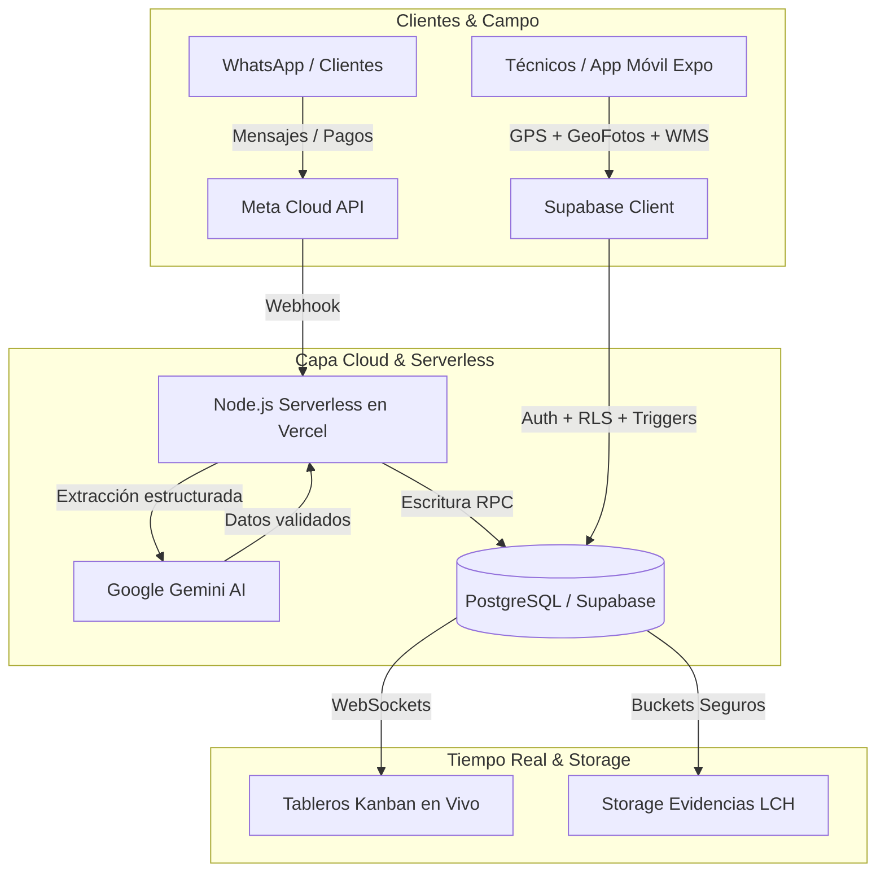

# Anthony Yariff Huice Martínez
### Desarrollador Full-Stack & Móvil | Software Engineer

[-2E7D32?style=flat)](mailto:anthonyhuice92@gmail.com)

  <b>T.S.U. en Informática · Estudiante de Ingeniería en Informática (IUNAV)</b> 
  Especializado en arquitectura de software escalable, aplicaciones web y móviles de alto rendimiento, bases de datos relacionales seguras en la nube (Supabase/PostgreSQL) e integración de automatizaciones con Inteligencia Artificial.

---

## 🛠️ Stack Tecnológico Principal

| Área | Tecnologías |
| :--- | :--- |
| **Frontend & Web** | `TypeScript` · `JavaScript` · `Next.js (App Router)` · `React 19` · `Tailwind CSS` · `TanStack Query` · `Zustand` · `HTML5` · `CSS3` |
| **Desarrollo Móvil** | `React Native` · `Expo SDK` · `PWA (Service Workers)` |
| **Backend & Bases de Datos** | `Node.js` · `Express` · `Supabase` · `PostgreSQL` (RLS, RPCs, Triggers, GIN) · `REST APIs` · `SQL` |
| **IA & Automatización** | `Google Gemini API` · `Meta WhatsApp Cloud API` · `Webhooks` · `LLM Integration` |
| **DevOps & Entorno** | `Git` · `GitHub` · `Vercel` · `Linux` · `Windows` |

---

## 🚀 Proyectos Destacados & Arquitectura

> *Nota: Para salvaguardar la propiedad intelectual y los datos comerciales, los repositorios de código de producción son privados. A continuación se detalla la arquitectura de ingeniería, decisiones técnicas y capacidades de los sistemas.*

### 📡 1. Metricall — Suite Operativa CRM, ERP & WMS (Telecomunicaciones / ISPs)
Plataforma operativa integral multi-tenant desplegada y en uso activo para proveedores de internet (FTTH/ISPs). Resuelve el desorden de captura de datos en campo mediante flujos dinámicos estructurados, georreferenciación y automatización inteligente.

* **Stack:** `React Native` · `Expo SDK` · `TypeScript` · `Supabase (PostgreSQL 15+)` · `Node.js / Vercel` · `Google Gemini API` · `Meta WhatsApp Cloud API`
* **Módulos y Capacidades:**
  * **Tableros Kanban Operativos:** Gestión visual por fases (*Ventas*, *Factibilidad Técnica con Evidencia LCH*, *Asignación*, *Instalación*, *Activación* y *Liberadas*) con trazabilidad cronológica auditada.
  * **Georreferenciación y GeoFotos:** Registro obligatorio de coordenadas GPS y captura de evidencias de instalación (caja NAP y residencia).
  * **WMS & Control de Materiales:** Inventario central y asignación de custodia personal a técnicos con control de modelos y seriales de ONUs/Routers, y generación de órdenes con firma digital manuscrita.
  * **Bot de WhatsApp con IA:** Integración con la API de Meta y **Google Gemini** para la extracción automatizada y estructurada de prospectos, procesamiento interactivo de reportes de pago y atención técnica de fallas.
  * **Arquitectura de Base de Datos:** Más de 100 políticas **Row-Level Security (RLS)** denormalizadas por tenant (cero JOINs para alto rendimiento), funciones transaccionales RPC con `SECURITY DEFINER` e índices GIN.

---

### 🚗 2. Plataforma E-Commerce Transaccional (Vehículos y Repuestos)
Marketplace moderno y transaccional diseñado para la compra-venta de vehículos y catálogo masivo de repuestos con control riguroso de inventario y optimización para el mercado venezolano.

* **Stack:** `Next.js (App Router)` · `React Server Components (RSC)` · `TypeScript Strict` · `Tailwind CSS` · `Supabase` · `TanStack Query` · `Zustand` · `Zod`
* **Aspectos de Ingeniería Destacados:**
  * **Estrategia de Renderizado Híbrido:** Listados públicos de catálogo optimizados mediante **ISR (Incremental Static Regeneration)** y páginas de detalle con **SSR**, garantizando máxima velocidad y SEO dinámico con Open Graph.
  * **Consistencia Transaccional Estricta:** Lógica de reservación y venta implementada mediante Funciones RPC en PostgreSQL con bloqueo a nivel de fila (`SELECT FOR UPDATE`), eliminando condiciones de carrera en inventario concurrente.
  * **Seguridad y Sesiones:** Autenticación robusta en el servidor con `@supabase/ssr` y middleware de sesión, eliminando el parpadeo de contenido (FOUC).
  * **Arquitectura de Estado Desacoplada:** Frontera estricta entre **TanStack Query** (datos asíncronos del servidor) y **Zustand** (estado efímero de UI y filtros).

---

### 🛒 3. Mercatodo 8000 — Sistema Backend de Gestión de Pedidos y Facturación
Solución web desarrollada para optimizar el ciclo de venta comercial y generación automatizada de formatos digitales.

* **Stack:** `Node.js` · `Express` · `JavaScript` · `API REST` · `PostgreSQL / SQL`
* **Capacidades:**
  * Centralización de pedidos, control de estados de orden y emisión digital de recibos y facturación.
  * Arquitectura desacoplada garantizando compatibilidad multiplataforma y cero downtime operativo en entornos Linux y Windows.

---

## 🎓 Formación Académica

* **Ingeniería en Informática (En curso)** — *Instituto Universitario Adventista de Venezuela (IUNAV)*
* **Técnico Superior Universitario en Informática (Culminado)** — *Instituto Universitario Adventista de Venezuela (IUNAV)*
* **Técnico Medio en Contabilidad (Culminado)** — *U.E. Santa Teresa de Jesús (Fe y Alegría)*

---

  <b>¿Te interesa colaborar o conversar sobre una oportunidad?</b> 
  📬 <a href="mailto:anthonyhuice92@gmail.com">anthonyhuice92@gmail.com</a> · 💼 <a href="https://www.linkedin.com/in/anthony-huice-61906b377">LinkedIn</a>

